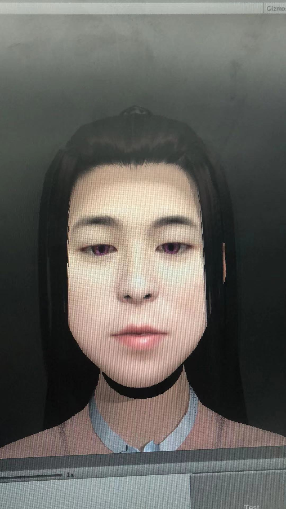

# Face3D  

Quickly generate face features of 3D game model by using apple arkit plug-in  

The open source solution is completely different from the patent applied by the company. You can use it with confidence, but the body image resources and 3D model resources are all owned by the original company and are not included in this open source package. You need to Make it yourself.  

[more infomation](./doc/README.md)  
preview

  
