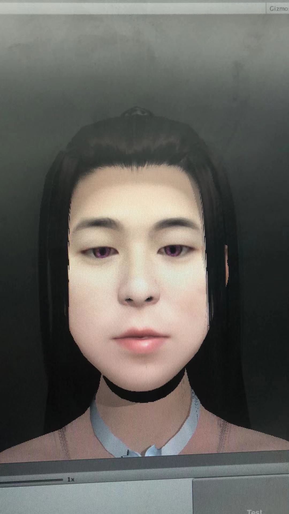

## Step 1 Get Mesh and Photo Resources

The first step is to get the face mesh through the ios device. This one has an interface, just check the official Apple documentation.  
After obtaining the Mesh, it is naturally stitched. You can see the picture below. The main thing to pay attention to is the point-to-point stitching and adding surface. If you don't understand, you can ask your art friends around you.   
At the same time, get the photo at this time and calculate the UV.

preview  

## Step 2 Microdermabrasion and whitening, you can use open source framework
The above model can be said to have taken the first step, but it is still very frustrated. There are acne marks on the face, which is definitely not good.   
Therefore, we have to perform normal whitening and dermabrasion. There are also related articles for reference, such as surface blur, edge preserving filter, and O(1)-based surface blur. Of course, you can also directly use a third-party whitening library to solve the problem.  
The following is a preview of the algorithm and whitening developed by myself.
preview  

preview  

preview  

## Step 3 The facial features are preserved, made by Mask
Okay, after the above two steps, there are still obvious problems.   
The whitening power is too large, or whitening occurs, that is, the key features of oneself are also whitened off, such as eyebrows, mouth and other facial features.   
Note that the surface fuzzification is actually a kind of edge-preserving filter. The whitening mentioned here means that the brightening of the color is worth the operation. It can be adjusted by the L value in the HSL, so how to solve the overall problem of over-white or over-black?  
The third part is the recognition of the key points of the face. Most of the face recognition plug-ins on the market have 108 recognition. Below is a picture that is particularly happy, which is the figure after the key points of the face are stitched into a surface. .

preview  

* Note
This diagram and topology are the same as the uv topology of the mesh obtained by the ios device.

## Step 4 Mask advanced usage -- look up table 

There is a conversion relationship between the photo screen UV and this picture UV.   
The specific point is that one vertex of the model corresponds to two sets of uv.   
The mesh of the ios device contains a set of topological uv, and the other set is the screen coordinates of the photo, which is accurate It is the viewport coordinates, here you can construct a lut for query.
When whitening in the following steps, just filter this Mask.  
Of course, the edge part can reserve a channel for fusion when constructing this graphic.

## Step 5 Change pupil color through Mask map and identify pupil algorithm
Identify the black area of ​​the pupil, calculate the physical center, and map the pupil color map to it through model mapping.  

Preview  

## Step 6 Preserve the details of the facial features through the Mask map
Color the lips  
You can take a look at the effect in the picture below. Although the skin color is burst, but the eyebrows and mouth are basically retained.
male  

Female   

## Step 7 Detect the dirty area through the skin color detection algorithm
When taking pictures, there is no guarantee that the user will not be able to take pictures of hair, or that the light is not good, and the picture is too dark, so it is also important to prompt the dirty area.  
Preview  

## Step 8 Machine learning algorithm removes light from photos

The part about light should also be considered carefully. This part is difficult. Perhaps machine learning is an idea.

## be careful
Regarding the part of the pupil color, you can consider using fake eyeballs to achieve it, but pay attention to whether there are holes in the eye sockets on the front face. You can also consider texture replacement, but the texture accuracy of the front face photo is bound to be improved, and this is communicated with the ios device manufacturer, because the picture itself is 720p, and the proportion of the eyes is very small and not detailed enough.

Finally, I will show you the finished product
