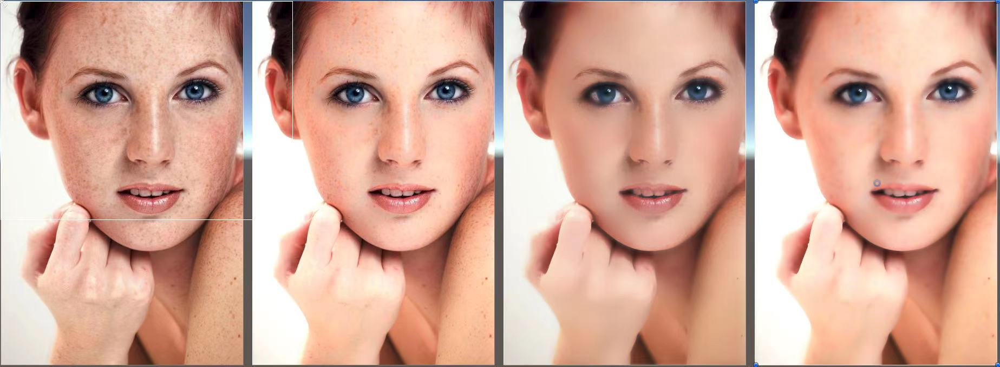
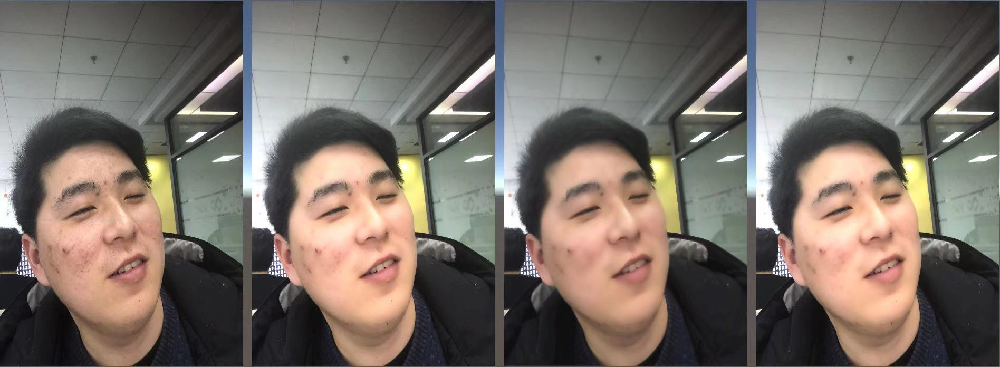
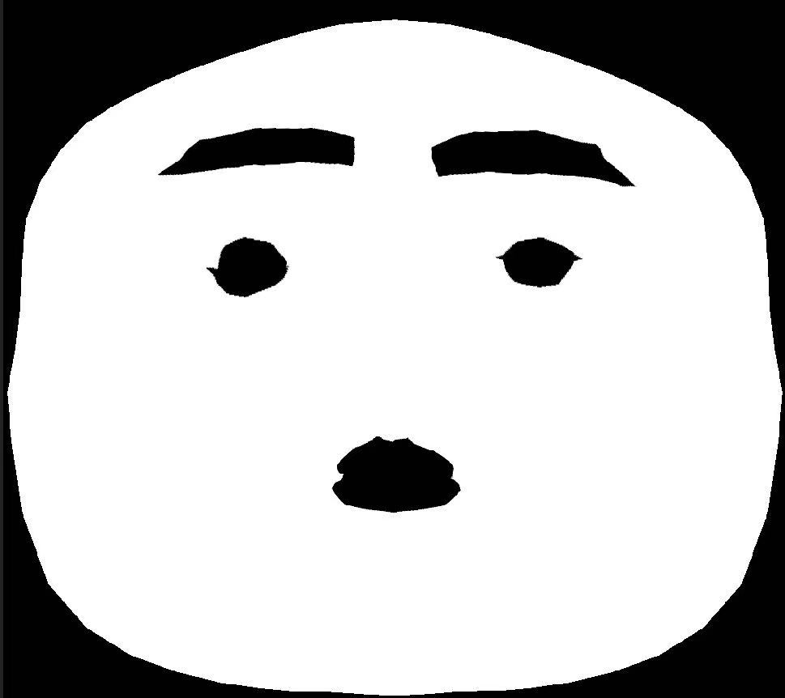
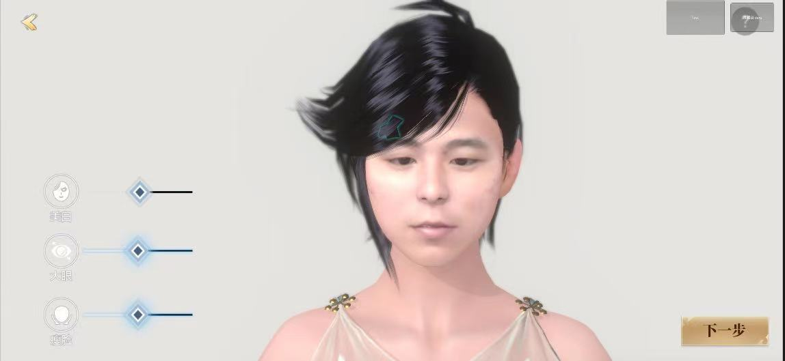
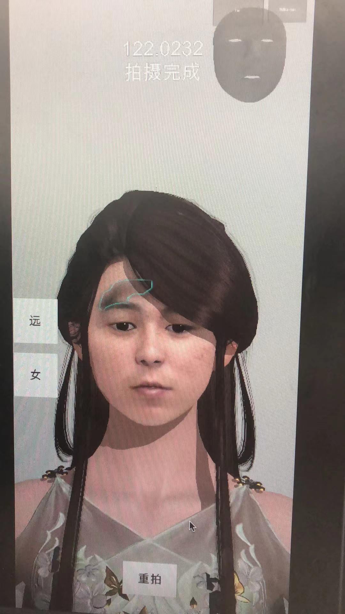

## Step 1 获取Mesh和照片资源

第一步是通过ios设备获取人脸的Mesh，这个有接口的，查一下苹果官方文档就可以了，
获取Mesh之后自然是缝合，可以看下图，主要要注意点对点缝合，加面，如果你不懂，可以问问身边的美术朋友。同时也要获得此时的照片，把UV算好。  

## Step 2 磨皮美白，可以使用开源框架
上面的模型可以说迈出第一步了，但是还是很挫，脸上有痘印，这肯定不行的。所以我们还要正常的美白，磨皮，这里也是有相关文章可以参考的，比如表面模糊，保边过滤器，基于O(1)的表面模糊。当然也可以直接使用第三方的美白库来解决问题。  
以下是我自己研发的算法和美白预览。  
10  

11  

12  

## Step 3 五官特征保留，Mask制作
好的，经过上面的两步之后，还是有明显的问题的，美白力度过大，或产生泛白，就是说，自己本身的关键特征点也被美白掉了，比如眉毛，嘴巴等五官区域，注意，表面模糊化其实是一种保边过滤器，这里说的美白是指提亮颜色值得操作，可以通过HSL中L值来调整，那么怎么解决整体过白或者过黑的问题？  
第三部就是人脸关键点的识别了，市面上的人脸识别的插件大都数都有108的识别，下面放一张特别喜感的图，就是把人脸关键点缝合成面之后的图形。

6

* 注意  
这个图和拓扑结构和ios设备获得的mesh的uv的拓扑机构是一样的.   

## Step 4 Mask高阶用法lut查询图制作

照片屏幕UV和这个图UV存在转换关系，具体点就是，模型的1个顶点对应2套uv即可，ios设备的mesh是包含一组拓扑uv，另外一组则是照片的屏幕坐标了，准确的讲是视口坐标，这里可以构造一张lut用来查询。  
后面的步骤中美白时候，过滤一下这个Mask就可以了。  
当然边缘部分在构造这个图形的时候可以保留一个通道用来融合。  

## Step 5 通过Mask贴图换瞳色，识别瞳孔算法
识别瞳孔的区域的黑色，计算出物理中心，通过模型映射，讲瞳色贴图映射到其中
预览  
  
## Step 6 通过Mask贴图保留五官细节
给嘴唇上色  
可以看一下下图的效果，虽然皮肤颜色拉爆了，但是眉毛嘴巴基本得以保留。  
男

女 

## Step 7 通过肤色检测算法，检测出脏区
拍照的时候不能保证用户拍不到头发，或者光线不好，照片过于阴暗，所以提示脏区也很重要。
预览  

## Step 8 机器学习算法去掉照片上的光

关于光线的部分也是要好好考虑的，这部分很难，可能机器学习是个思路。  

## 注意点
关于瞳色的部分，可以考虑用假眼球来实现，但是要注意前脸缝合眼眶处是否有漏洞。也可以考虑贴图替换，但是这个前脸的照片的贴图精度势必要提高，而这个就和ios设备厂商沟通了，因为图片本身就是720p的，眼睛部分占比非常小，不够精细。  

最后给大家看一下成品

